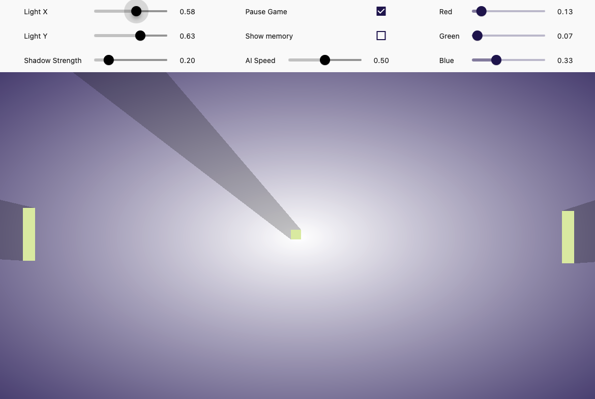

# Pong

Basic Pong Game written in a single GLSL shader running in a Flutter application.

## Demo

See the [demo video](https://raw.githubusercontent.com/wolfenrain/shady_frog/main/assets/demo.mp4)

## How to run

Works on Android iOS, macOS, Windows and Linux.

1. Clone the repository
2. Switch to the `master` channel: `flutter channel master`
3. Run `flutter pub get` in the root directory
4. Run `flutter run` in the root directory
5. Uncheck the "Pause Game" checkbox in the Flutter application to start the game

> **Note**: don't run the application for too long as there is a memory leak in the shader implementation of Flutter related to constantly updating an image sampler.

## How to play

You don't, currently it is just a demo that uses an AI that plays against itself (all still happening in the shader).

## How it works

The game is written in a single GLSL shader that runs on the GPU. The shader holds both the game state and the game logic. The Flutter application is just a window that displays the output of the shader and has a crude implementation of a game loop that calls the shader.

The shader renders the game itself by using the red, green and blue channel of a pixel. The shader also executes the game logic and stores the game state in the alpha channel of specific pixels, which we call memory blocks. This all happens on every pixel in parallel.

The output of the shader is then displayed on the screen by rendering it as an image. But as mentioned before, the pixels alpha channels are used for memory so we render a black background before we render the image to blit the image with.

By blitting black (0, 0, 0, 1) with our image pixels we are able to show the game rendering without the memory blocks. This allows us to keep only the channel values of every pixel whose value is not equal to our background.

## Why?

This project is a proof of concept to see if it is possible to write a game in a single GLSL shader on Flutter. It is not meant to be a fully functional game, it probably never will be.

The idea is based on [shader-pong](https://github.com/KyleBanks/shader-pong) ([YouTube video](https://www.youtube.com/watch?v=e-hTTVr_pDI)) by Kyle Banks. Which has done all the hard work of figuring out how to write a game in a single GLSL shader, I just ported it over to Flutter and struggled with the memory management.

Shout out to [Renan](https://twitter.com/reNotANumber) for inspiring me by doing  [this banger of a tweet](https://twitter.com/reNotANumber/status/1599810391625719810).